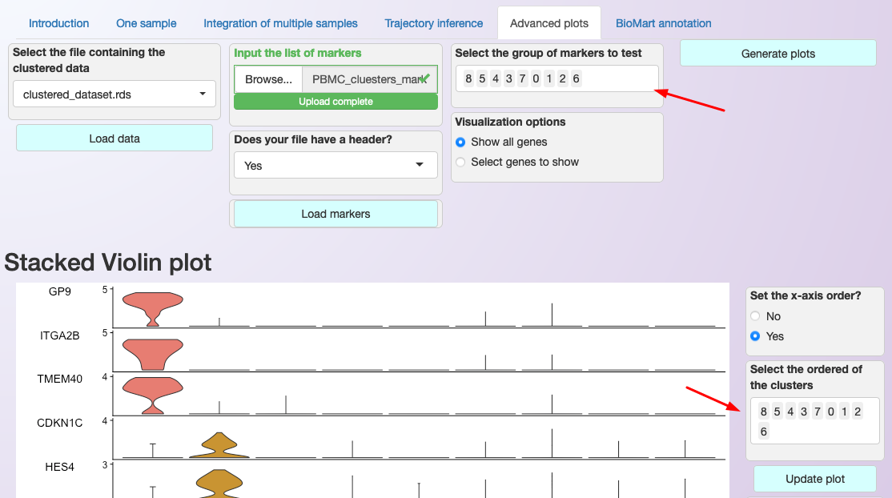
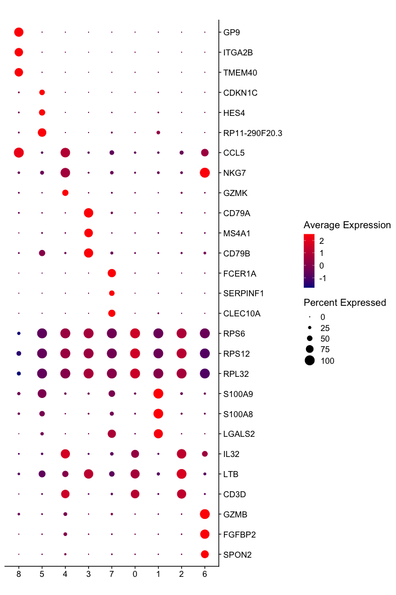

.. _Advanced_plots:

**************
Advanced plots
**************

As shown in the sections describing the expression visualization tools (:ref:`here <expression_visualization>` and :ref:`here <expression_visualization_int>`), Asc-Seurat provides a diversity of plots to explore your dataset. However, it focuses on exploring each gene individually, not providing tools to visualize the expression of multiple genes at once.

Starting on v2.0, Asc-Seurat also provides the capacity of generating dot plots and "stacked violin plots" comparing multiple genes.

Using an rds file containing the clustered data as input, users must provide a csv or tsv file in the same format described in the :ref:`expression visualization <expression_visualization_int>` section. Next, using the grouping variable, column two of the csv (or tsv), select the sets of genes to be used in the plot. Both violing and dot plot will be generated.

Stacked Violin plot
===================

Stacked violin plots are a popular way to represent the expression of gene markers but are not provided by Seurat. Asc-Seurat's version of the stacked violin plot is built by adapting the code initially posted on the blog "`DNA CONFESSES DATA SPEAK <https://divingintogeneticsandgenomics.rbind.io/post/stacked-violin-plot-for-visualizing-single-cell-data-in-seurat/>`_", by Dr. Ming Tang.

Note that the genes (y-axis) **will be displayed following the order of the grouping variable (column two of your file) selected by the user**. Once the plot is generated, users can choose the order of the clusters to show on the x-axis. For example, we show the expression profile of the three most significant gene markers identified for each cluster of the PBMC dataset.

An arbitrary order of the clusters is used in the plot, demonstrating how users can customize the result.

  Interface for generating multiple genes plot. Note that users can select the order that genes (y-axis) and clusters (x-axis) are shown; see the red arrows in the image.

  .. figure:: images/Stacked_violin_plot_PBMC.png
    :alt: Multigenes_dot_plot
    :width: 80%
    :align: center

    Stacked violin plot showing the three most significant markers of each cluster of the PBMC dataset. Observe that some of the significant markers are not specific for the cluster but present a higher level of expression than the other clusters.

Multiple-genes Dot plot
=======================

A multiple-genes dot plot will be generated following the same order selected for the stacked violin plot.

  Multiple-genes dot plot showing the three most significant markers of each cluster of the PBMC dataset. Observe that some of the significant markers are not specific for the cluster but present a higher level of expression than the other clusters.
