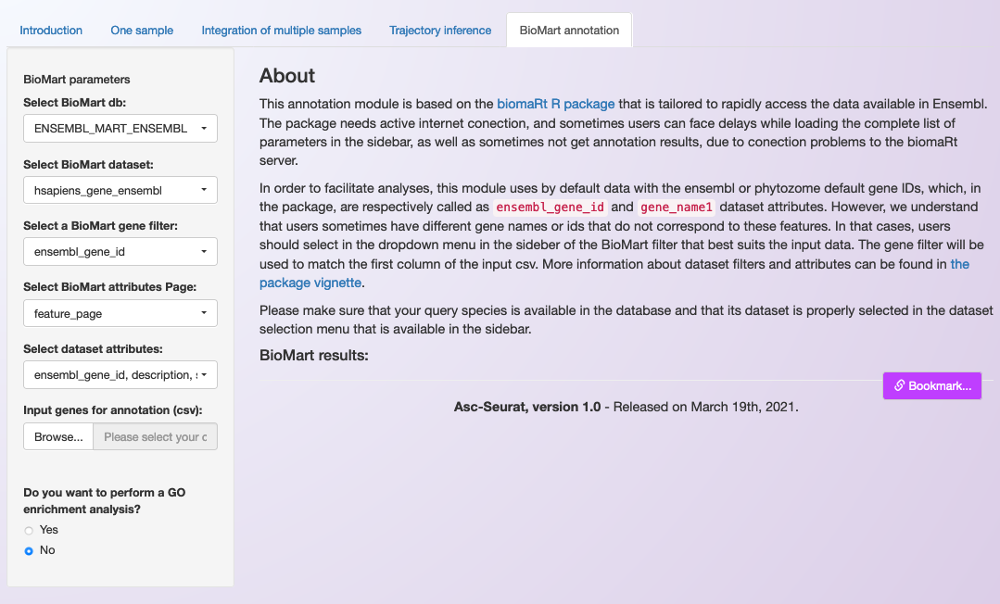
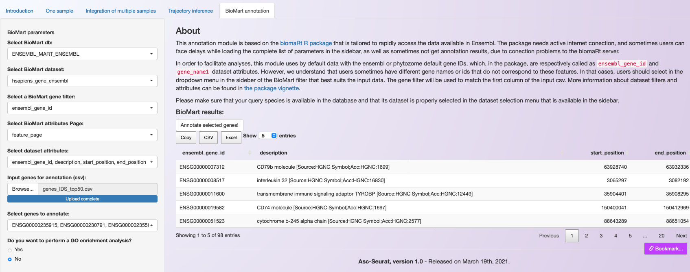
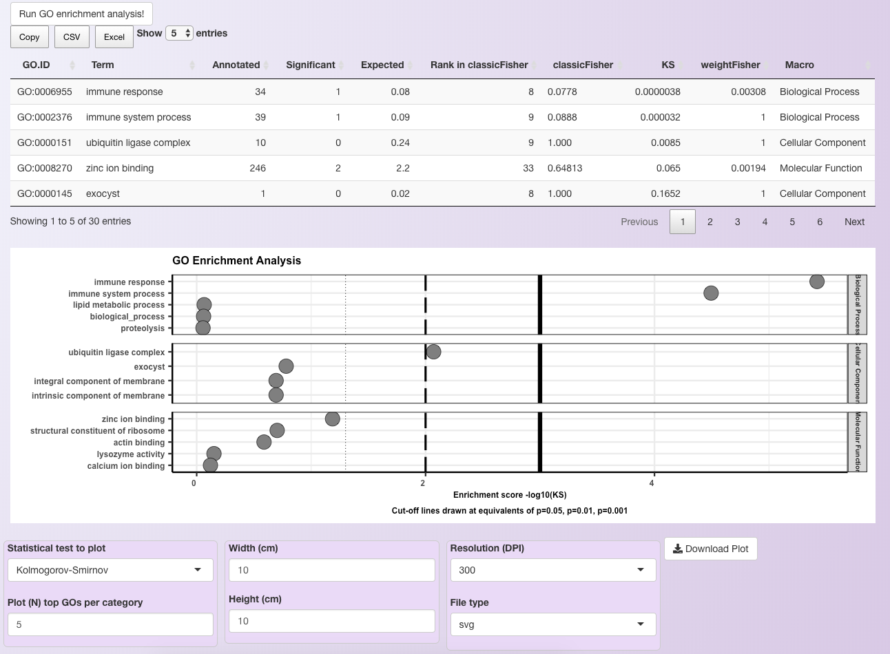

.. _biomart:

******************
Biomart annotation
******************

The annotation module of Asc-Seurat is based on the `biomaRt <https://bioconductor.org/packages/release/bioc/html/biomaRt.html>`_ package (Bioconductor). BiomaRt is designed to facilitate the functional annotation of genes, available for a variety of species, thought the  `BioMart <http://www.biomart.org/>`_ databases. To date, the main databases in BioMart are the ones provided by Ensenmbl. Fortunately, biomaRt provides direct access to these datasets, and they can all be accessed via Asc-Seurat. Moreover, due to its importance for plant species, we also incorporated access to the Phytozome's BioMart database.

Functional annotation of genes
==============================

The annotation module of Asc-Seurat was design to be simple to use (See image below). Nonetheless, a basic understanding of how BioMart queries are build is required, so users can select the filters and attributes needed. Please, visit biomaRt's `vignettes <https://www.bioconductor.org/packages/devel/bioc/vignettes/biomaRt/inst/doc/accessing_ensembl.html>`_ for an overview.

As shown in the image above, Asc-Seurat contains a side bar on which users can select the best parameters for the annotation of their genes. Initially, users should select the database to use (Phytozome or one of Ensembl's databases). Then, Asc-Seurat will load it and display the datasets (species) available for the selected database.

After selecting the species' dataset to use, users can define the filter and attributes of the query. In summary, the filter corresponds to your dataset being used as input and, for most cases, will be the gene IDs or the gene names. The attributes are the information that you want to extract from the database, e.g. description of the gene function, Gene Ontology (GO) terms, Pfam domains and etc. Please check `this section <https://www.bioconductor.org/packages/devel/bioc/vignettes/biomaRt/inst/doc/accessing_ensembl.html#searching-for-filters-and-attributes>`_ of biomaRt's vignettes for an example.

After defining the filter and the attributes, users can provide a csv file containing a list of gene ids (or gene names) and start the query. Moreover, users have the option of selecting only a subset of the genes listed in the csv file, reducing the time necessary for the annotation.

.. note::

	The input csv file should contain one or more columns, separated by commas. A header is required, but users are free to use their choice of column(s) name(s). The only required information is the gene ids, or gene names, one entrance per line. Asc-Seurat will ignore other columns that might be present. The csv files generated within Asc-Seurat are adequate as input for the annotation.

To execute the annotation, user need to click on :guilabel:`Annotate selected genes!`. An iterative table containing the requested information will be generated. In addition, users can download the list of annotated genes as a csv or an Excel file (see below).

GO terms enrichment analysis
============================

Asc-Seurat also provides an option to execute the GO terms enrichment analysis using `topGO <https://bioconductor.org/packages/release/bioc/html/topGO.html>`_, a Bioconductor package.

The goal of this analysis is to identify genes over/under represented in your set of genes being annotated (known as target) in comparison with a broader set of genes (known as universe). The universe can be a set of all genes expressed in the dataset, or any set of genes that the user desire to compare with the their set of genes being annotated.

If users choose to execute this analysis, they need to provide a second csv file containing the list of genes to be used as the "universe" of the analysis.

.. warning::

    Both set of genes should contain the same type of identifier (i.e gene ID). Also, be aware of extra spaces or any discrepancy between the identifiers of the two set of genes.

At the end of the GO enrichment analysis, an iterative table containing all enriched GO terms is generated, which can be downloaded in the csv format or as an Excel file. Moreover, a plot showing the most significant GO terms is generated. Users can adjust the number of significant GO terms shown for each GO category in the plot (see below to an example using 5 GO terms per category).

