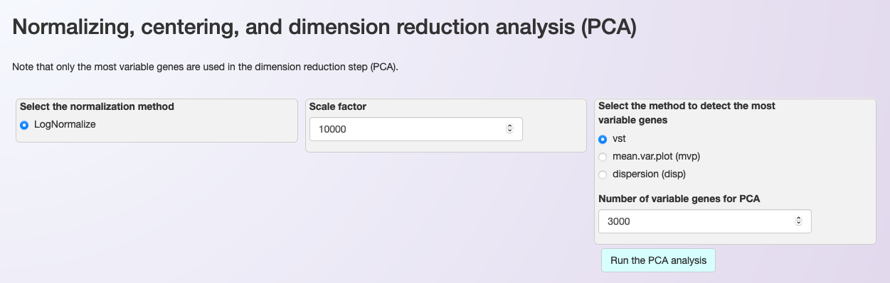
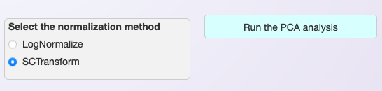
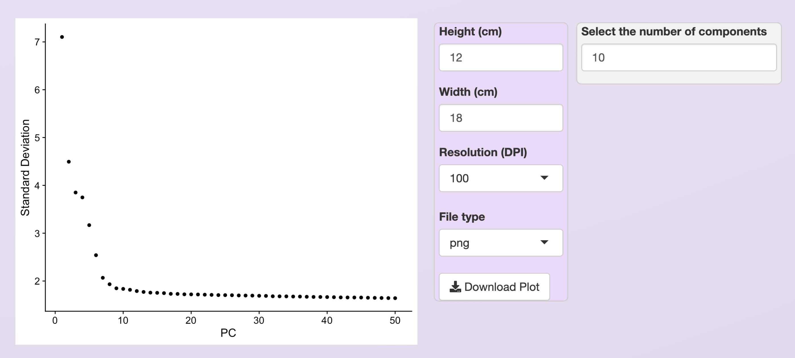
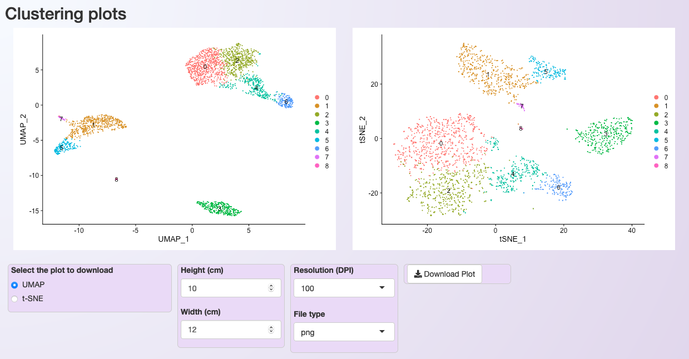
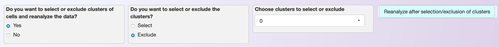
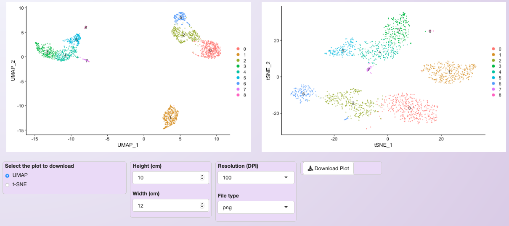

.. _clustering:

**********
Clustering
**********

After filtering the data to remove low-quality cells, Asc-Seurat allows clustering the remaining cells according to their expression profiles. However, before clustering, a series of steps are executed, including normalization, scaling (if using LogNormalization), and dimensional reduction via PCA.

Moreover, users need to decide how many dimensions are to be used during the clustering after executing the PCA. Asc-Seurat provides an elbow plot to inform this decision. Below are instructions on how to perform the clustering depending on the normalization method of choice.

Normalization
=============

LogNormalization
----------------

Asc-Seurat allows the normalization using Seurat's `LogNormalize <https://satijalab.org/seurat/reference/LogNormalize.html>`_ function. Users have the option to change the scaling factor if necessary, but it is typically not needed. In the same window (see the image below), users can select what method should be used to identify the most variable genes and how many of the most variable genes should be used during the dimension reduction (PCA).

The most variable genes exhibit high cell-to-cell variation in the dataset and therefore are more informative. We use Seurat's function `FindVariableFeatures <https://satijalab.org/seurat/reference/FindVariableFeatures.html>`_. The default setting should work well for the majority of cases.

SCTransform
-----------

The second option of normalization provided by Asc-Seurat is Seurat's Seurat's `SCTransform <https://satijalab.org/seurat/reference/SCTransform.html>`_. When using this normalization, it is unnecessary to set the scale factor or identify the most variable genes (See image below).

.. note::

    Currently, the recommendation of Seurat's team is to use the standard "RNA" assay when performing differential expression (D.E) analysis and for data visualization, even when using SCTransform (See `here <https://github.com/satijalab/seurat/discussions/4032>`_). Therefore, Asc-Seurat will use the SCTransformed data ("SCT" assay) until the clustering step only.

    To use the "RNA" assay after SCTransform, Asc-Seurat will automatically perform the LogNormalization and scaling of the data in the RNA assay by applying the default parameters.

Dimensional reduction (PCA)
===========================

The PCA will be executed using Seurat's function `RunPCA <https://satijalab.org/seurat/reference/RunPCA.html>`_ and, after its conclusion, an `elbow plot <https://satijalab.org/seurat/reference/ElbowPlot.html>`_ is generated automatically, to help users to decide how many PCs should be included to inform the clustering step.

Users can use this plot to select the PCs with the highest standard deviation (more informative PCs). Also, users should set the number of PCs to include during clustering in the windows at the plot's right side.

In the example below, only the first 10 PCs are selected. Not that the resulting plot will be slightly different depending on the normalization method. Below we show the plot obtained using the LogNormalization.

   Elbow plot provided to help to select the most informative PCs. For the PBMC dataset, and using the LogNormalization method, we chose the ten first PCs.

Clustering of cells
====================

The next step is the clustering of the cells. For that, Asc-Seurat used both `FindNeighbors <https://satijalab.org/seurat/reference/FindNeighbors.html>`_ and `FindClusters <https://satijalab.org/seurat/reference/FindClusters.html>`_ functions of the Seurat package.

Before the execution, however, users need to set a value for the resolution parameter. The resolution is an important parameter to evaluate because it determines the profile and number of clusters identified for a dataset. Selecting larger values will favor splitting cells into more clusters while choosing a smaller value has the opposite effect. Quoting from `Seurat's tutorial: <https://satijalab.org/seurat/archive/v1.4/pbmc3k_tutorial.html>`_ "We find that setting this parameter between 0.6-1.2 typically returns good results for single-cell datasets of around 3K cells. Optimal resolution often increases for larger datasets".

.. tip::

	There is no easy way to define an optimal value for the resolution parameter. Users need to try different values and evaluate the resulting clusters according to the expectation for their cells population. Visualizing the expression profile of cell-type-specific markers can provide a hint if the chosen value is too small or too large.

   Plot showing the clustering of the PBMC dataset after LogNormalization, using 10 PCs and a resolution value of 0.5.

After the execution of the clustering step, two plots are generated for cluster visualization. The first plot is generated using the Uniform Manifold Approximation and Projection (UMAP) technique (left). The second deploys the t-distributed Stochastic Neighbor Embedding (t-SNE) method (right).

.. _target_to_ref_excluding_clusters_one:

Selecting clusters of interest
------------------------------

In some cases, it is interesting to select or exclude some clusters of cells from the dataset before executing the subsequent steps. This process is helpful, for example, when users desire to explore a developmental trajectory of a specific group of cell types.

Asc-Seurat makes this step simple. Users only need to select the cluster(s) to keep or exclude and start reanalysis of the remaining cells by clicking on :guilabel:`Reanalyze after selection/exclusion of clusters` (see below).

   Asc-Seurat makes it easy to select or exclude a cluster (or clusters) of cells. In this example, we exclude all cells belonging to cluster 0.

Asc-Seurat will then execute the steps with the new set of cells up to the PCA. Then, **users need to evaluate the elbow plot and decide the number of PCs to cluster the new set of cells**. Users can either keep the same value for the resolution parameter or modify it before clicking on :guilabel:`Run the clustering analysis` to start the clustering once more.

  Clustering of the PBMC dataset after excluding cells belonging to cluster 0 from the original dataset.

.. warning::

	The cluster's numbering will change every time that cluster(s) are selected or excluded.
