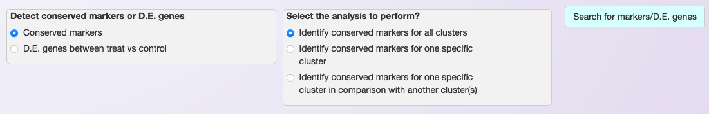
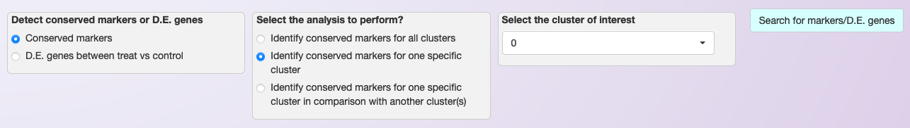
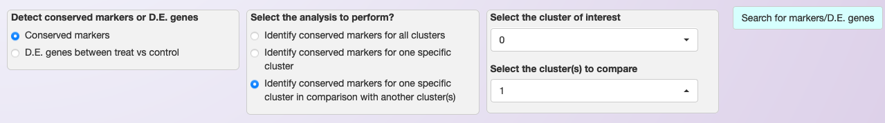
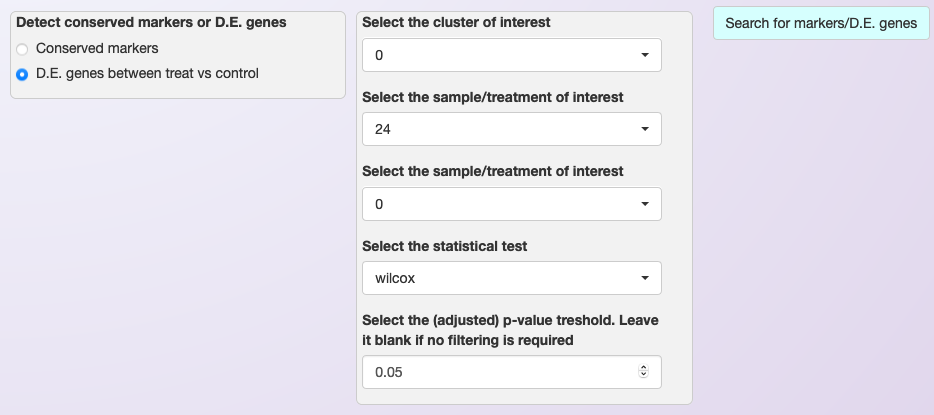
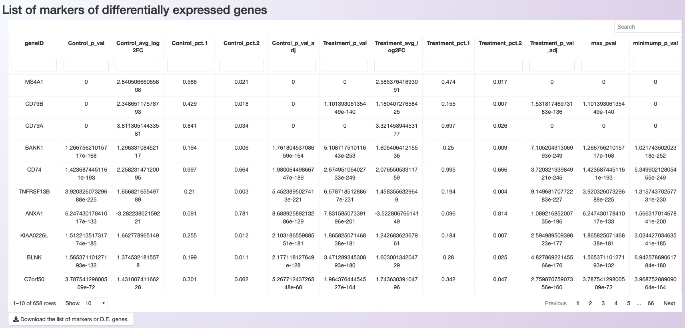

.. _differental_expression_int:

***********************************************************
Markers identification and differential expression analysis
***********************************************************

After clustering the cells, users may be interested in identifying genes specifically expressed in one cluster (markers) or in genes that are differentially expressed among clusters of interest. Asc-Seurat can apply multiple algorithms to identify gene markers for individual clusters or identify differentially expressed genes (DEGs) among clusters. **Moreover, when using an integrated dataset containing multiple samples, it is possible to identify DEGs among samples for each cluster.**

.. note::

	When searching for markers of a cluster or DEGs among clusters using an integrated dataset, the search will attempt to find markers or DEGs conserved among samples.

Asc-Seurat allows users to filter gene markers and DEGs by the fold change and minimal percentage of cells expressing a gene in the cluster(s). Moreover, users can define a significance level to exclude genes based on the adjusted p-value (see below).

   Example of Asc-Seurat's interface showing the settings to the search for gene markers for each of the clusters and conserved among samples.

   Example of Asc-Seurat's interface showing the settings to the search for gene markers for a specific cluster and conserved among samples.

   Example of Asc-Seurat's interface showing the settings to search for DEGs genes among clusters 0 and 1.

  Example of Asc-Seurat's interface showing the settings to search for DEGs among samples for a specific cluster (cluster 0).

An iterative table will be available after executing the search for marker or DEGs, showing the significant genes. Moreover, users can download the list of significant markers or DEGs as a csv file.

   The ten most significant markers identified for cluster 4 of the PBMC integrated dataset (the clustering is shown in :ref:`clustering`).

The list of genes in the csv can then be used to visualize their gene expression in a series of plots, as shown in the section :ref:`expression_visualization_int`.
