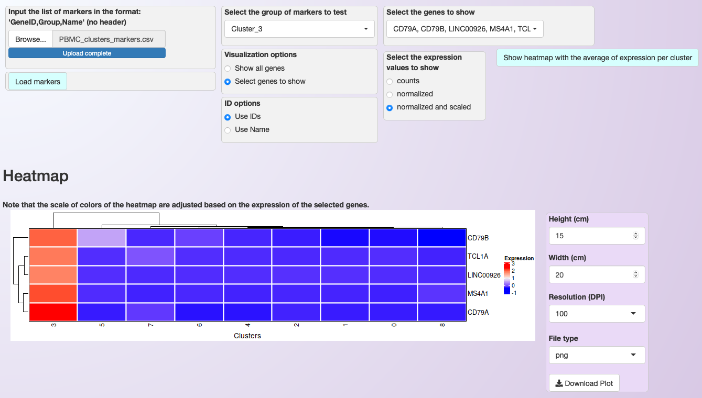
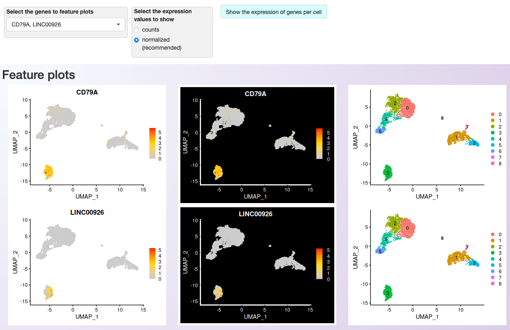
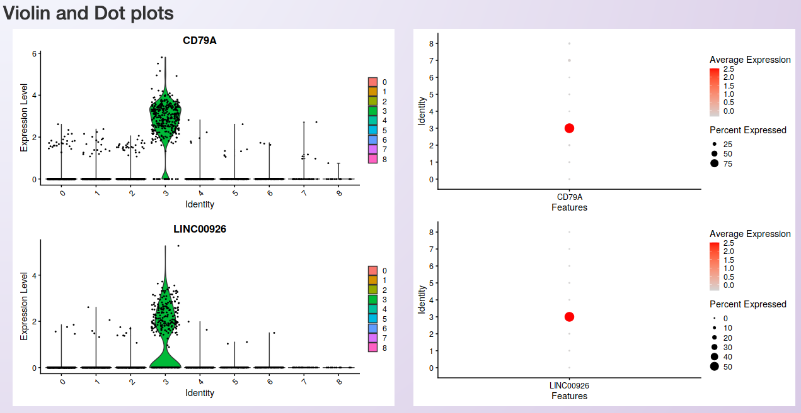

.. _expression_visualization:

************************
Expression visualization
************************

Asc-Seurat provides a variety of plots for gene expression visualization. From a list of selected genes, it is possible to visualize the average of each gene expression in each cluster in a heatmap. It also provides plots for the visualization of gene expression at the cell level. Moreover, violin plots and dot plots allow the visualization of each cluster's expression, emphasizing the inter-cluster comparison.

Format of the input file containing genes for expression visualization
======================================================================

Asc-Seurat expects as input a csv (comma-separated value) or a tsv (tab-separated value) file containing at least two columns. The first column must contain the gene ID as present in the dataset, and the second column is a grouping variable. An optional third column can contain the common names of each gene. Any additional column will be ignored. The output files generated by the differential expression analysis are already in the correct format to be used as input for the visualization.

Below is shown an example of an input file used for expression visualization. It contains ten markers identified for clusters 2 and 3. In this case, the dataset uses the gene name as an identifier, and this is the information on the first column. The second column is used to group de marker according to their clusters.

.. table:: Example of an input file for gene expression visualization showing the required columns.
   :widths: 33 33 33
   :align: center

   +-----------+-----------+-----------+
   | IL32      | Cluster_2 |           |
   +-----------+-----------+-----------+
   | LTB       | Cluster_2 |           |
   +-----------+-----------+-----------+
   | LDHB      | Cluster_2 |           |
   +-----------+-----------+-----------+
   | CD3D      | Cluster_2 |           |
   +-----------+-----------+-----------+
   | IL7R      | Cluster_2 |           |
   +-----------+-----------+-----------+
   | MS4A1     | Cluster_3 |           |
   +-----------+-----------+-----------+
   | CD79A     | Cluster_3 |           |
   +-----------+-----------+-----------+
   | CD79B     | Cluster_3 |           |
   +-----------+-----------+-----------+
   | LINC00926 | Cluster_3 |           |
   +-----------+-----------+-----------+
   | TCL1A     | Cluster_3 |           |
   +-----------+-----------+-----------+

After loading the input file, users can select what group(s) of genes to explore and choose specific genes from each group. Moreover, if a third column is provided in the input file, users can use the genes' common name instead of the gene IDs to select the genes to be shown.

Heatmap
=======

Once users selected their genes of interest, they can generate a heatmap of the average of each gene expression in each cluster by clicking on the button :guilabel:`Show heatmap with the average of expression per cluster`. The heatmap will adjust its height according to the number of selected genes. Moreover, rows and columns will be organized by a hierarchical clustering algorithm. A high-resolution copy of the heatmap plot can be download in a diversity of formats.

   Asc-Seurat's interface demonstrating the filtering options provided to select the genes for expression visualization. The heatmap shows the expression profile of the five most significant markers for cluster 3.

Gene expression at the cell level - Feature plots
=================================================

From the list of genes on the heatmap, users can select genes to further explore by visualizing the expression at the cell level. For each selected gene, a couple of feature plots will be generated using Seurat's `Feature plots <https://satijalab.org/seurat/reference/FeaturePlot.html>`_ function. The UMAP plot is shown side-by-side with the feature plots, so users can quickly compare the expression profile with the identified clusters.

   Asc-Seurat's interface showing the filtering options provided to select the genes for expression visualization at the cell level. Two of the five genes shown on the heatmap were chosen for more detailed visualization.

Visualization of the expression among clusters
==============================================

For each selected gene, Asc-Seurat will also generate plots to visualize the distribution of cells within each cluster according to the expression of the gene (violin plot) and the percentage of cells in each cluster expressing the gene (dot plot). Seurat's functions `VlnPlot() <https://satijalab.org/seurat/reference/VlnPlot.html>`_ and `DotPlot() <https://satijalab.org/seurat/reference/DotPlot.html>`_ are deployed in this step.

   Visualization of the distribution of cells within each cluster according to the gene expression (violin plot; left) and the percentage of cells in each cluster expressing the gene (dot plot; right).

.. tip::

	Sometimes, it is necessary to make fine adjustments to an image before publication. Saving the plots as a `Scalable Vector Graphic (svg) <https://en.wikipedia.org/wiki/Scalable_Vector_Graphics>`_, allows the edition of all aspects of the plot by image edition software as `Inkscape <https://inkscape.org/>`_.
