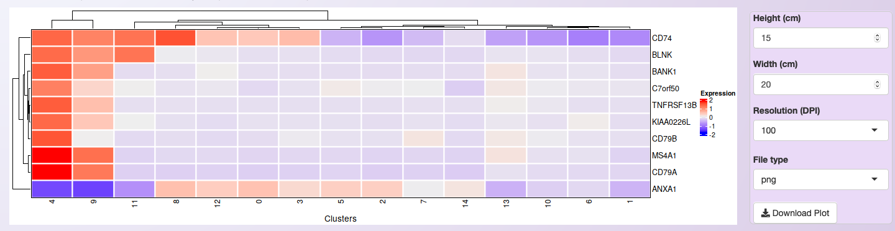
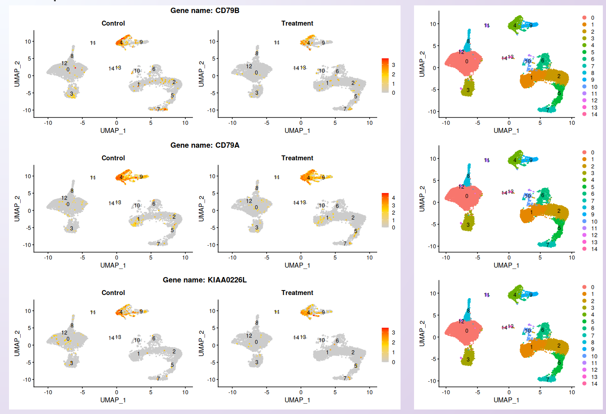
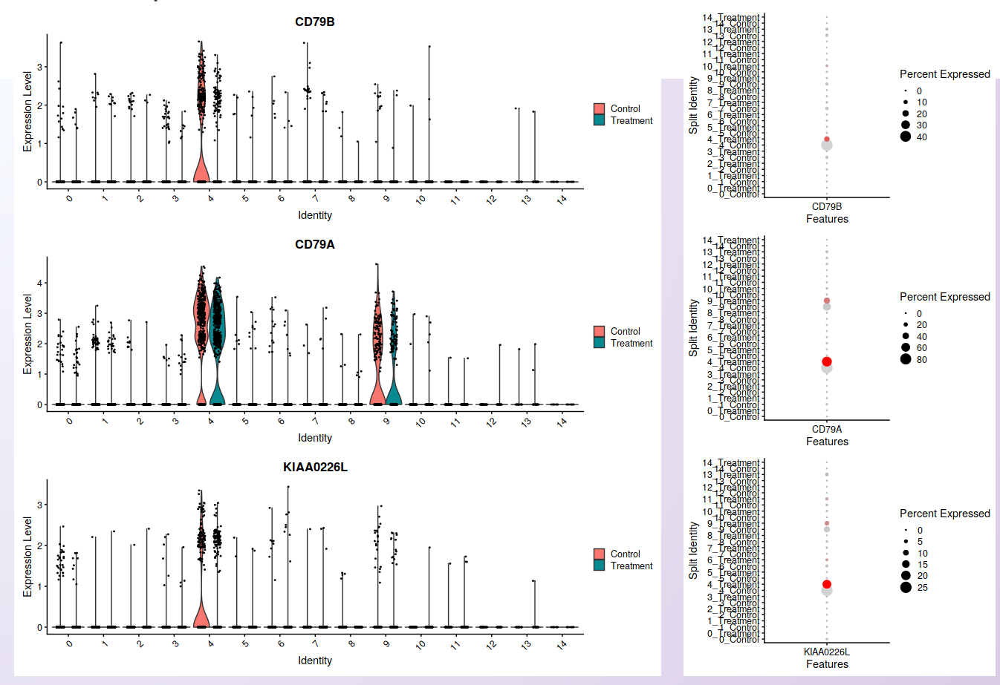
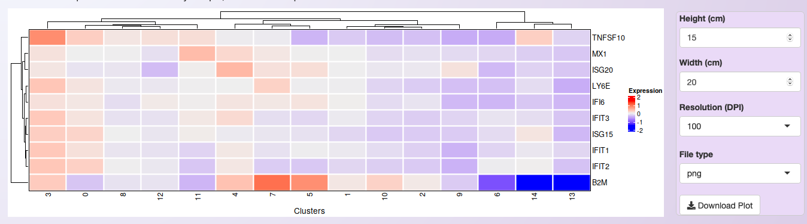
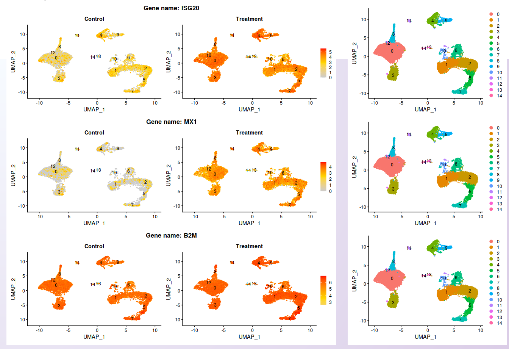
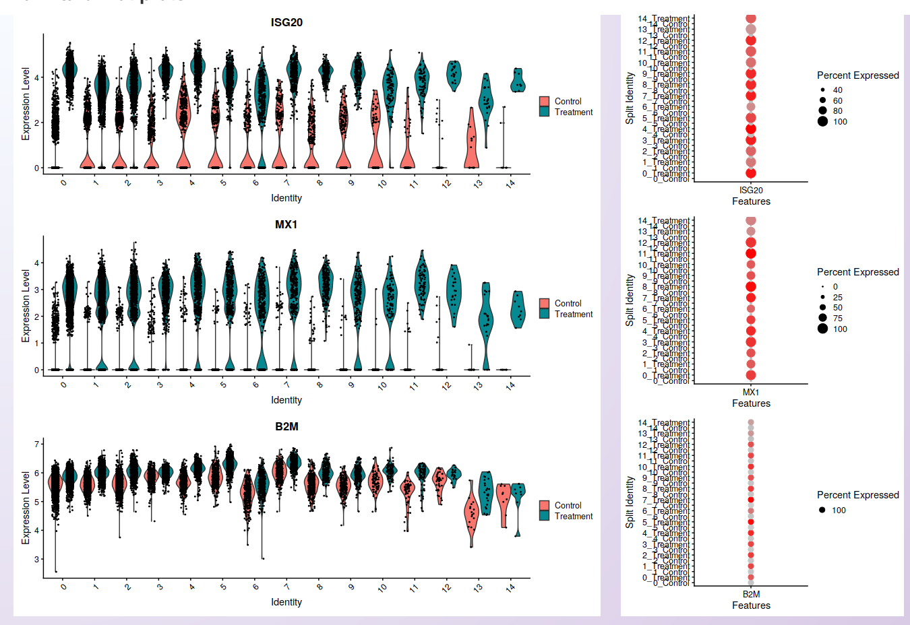

.. _expression_visualization_int:

************************
Expression visualization
************************

Asc-Seurat provides a variety of plots for gene expression visualization of the integrated data. From a list of selected genes, it is possible to visualize the average of each gene expression in each cluster in a heatmap. It also provides plots for the visualization of gene expression at the cell level. Moreover, violin plots and dot plots allow the visualization of each cluster's expression, emphasizing the inter-cluster comparison.

For the integrated dataset, besides identifying markers for each cluster and DEGs among clusters, it is also possible to identify DEGs among samples (See :ref:`differental_expression_int`). Below are shown examples of plots that Asc-Seurat generates to allow the expression visualization in all these cases.

Expression visualization of genes identified as markers
=======================================================

Format of the input file containing genes for expression visualization
----------------------------------------------------------------------

Asc-Seurat expects as input a csv (comma-separated value) or a tsv (tab-separated value) file containing at least two columns. The first column must contain the gene ID as present in the dataset, and the second column is a grouping variable. An optional third column can contain the common names of each gene. Any additional column will be ignored. The output files generated by the differential expression analysis are already in the correct format to be used as input for the visualization.

Below is shown an example of an input file used for expression visualization. It contains ten markers identified for cluster 4 of the PBMC integrated dataset (Control and Treatment). In this case, the dataset uses the gene name as an identifier, and this is the information contained in the first column. The second column is used to group de marker according to their clusters.

.. table:: Example of an input file for gene expression visualization showing the required columns.
   :widths: 33 33 33
   :align: center

   +-----------+-----------+-----------+
   | MS4A1     | Cluster_4 |           |
   +-----------+-----------+-----------+
   | CD79B     | Cluster_4 |           |
   +-----------+-----------+-----------+
   | CD79A     | Cluster_4 |           |
   +-----------+-----------+-----------+
   | BANK1     | Cluster_4 |           |
   +-----------+-----------+-----------+
   | CD74      | Cluster_4 |           |
   +-----------+-----------+-----------+
   | TNFRSF13B | Cluster_4 |           |
   +-----------+-----------+-----------+
   | ANXA1     | Cluster_4 |           |
   +-----------+-----------+-----------+
   | KIAA0226L | Cluster_4 |           |
   +-----------+-----------+-----------+
   | BLNK      | Cluster_4 |           |
   +-----------+-----------+-----------+
   | C7orf50   | Cluster_4 |           |
   +-----------+-----------+-----------+

After loading the input file, users can select what group(s) of genes to explore and choose specific genes from each group. Moreover, if a third column is provided in the input file, users can use the genes' common name instead of the gene IDs to select the genes to be shown.

Heatmap
-------

Once users selected their genes of interest, they can generate a heatmap of the average of each gene expression in each cluster by clicking on the button :guilabel:`Show heatmap with the average of expression per cluster`. The heatmap will adjust its height according to the number of selected genes. Moreover, rows and columns will be organized by a hierarchical clustering algorithm. A high-resolution copy of the heatmap plot can be download in a diversity of formats.

.. warning::

    For the integrated dataset, the heatmap shows the average expression of all samples together. It is only helpful to identify if the cell types' markers make sense with the number of generated clusters.

   Heatmap showing the expression profile of the then most significant markers for cluster 4 of the integrated datasets.

Gene expression at the cell level - Feature plots
-------------------------------------------------

From the list of genes on the heatmap, users can select genes to further explore by visualizing the expression at the cell level. For each selected gene, a feature plot showing each sample's profile will be generated using Seurat's `Feature plots <https://satijalab.org/seurat/reference/FeaturePlot.html>`_ function. The UMAP plot is shown side-by-side with the feature plots, so users can quickly compare the expression profile with the identified clusters.

   Visualization of the expression profile of three of the genes shown on the heatmap in each sample.

Visualization of the expression among clusters
----------------------------------------------

For each selected gene, Asc-Seurat will also generate plots to visualize the distribution of cells within each cluster according to the expression of the gene (violin plot) and the percentage of cells in each cluster expressing the gene (dot plot) in each sample. Seurat's functions `VlnPlot() <https://satijalab.org/seurat/reference/VlnPlot.html>`_ and `DotPlot() <https://satijalab.org/seurat/reference/DotPlot.html>`_ are deployed in this step.

   Visualization of cells' distribution within each cluster according to the gene expression (violin plot; left) and the percentage of cells in each cluster expressing the gene (dot plot; right) in each sample. The three genes shown are the same used for the feature plots.

Expression visualization of differentially expressed genes
==========================================================

Format of the input file containing genes for expression visualization
----------------------------------------------------------------------

As before, a csv or tsv file is necessary as input for the expression visualization of DEGs. In this case, it contains ten genes identified as DEGs between the PBMC Treatment and PBMC Control datasets in cluster 4.

.. table:: Example of an input file for gene expression visualization of DEGs.
   :widths: 33 33 33
   :align: center

   +-----------+----------------+-----------+
   | ISG15     | DEGs Cluster_4 |           |
   +-----------+----------------+-----------+
   | IFIT3     | DEGs Cluster_4 |           |
   +-----------+----------------+-----------+
   | IFI6      | DEGs Cluster_4 |           |
   +-----------+----------------+-----------+
   | ISG20     | DEGs Cluster_4 |           |
   +-----------+----------------+-----------+
   | IFIT1     | DEGs Cluster_4 |           |
   +-----------+----------------+-----------+
   | MX1       | DEGs Cluster_4 |           |
   +-----------+----------------+-----------+
   | LY6E      | DEGs Cluster_4 |           |
   +-----------+----------------+-----------+
   | TNFSF10   | DEGs Cluster_4 |           |
   +-----------+----------------+-----------+
   | IFIT2     | DEGs Cluster_4 |           |
   +-----------+----------------+-----------+
   | B2M       | DEGs Cluster_4 |           |
   +-----------+----------------+-----------+

Heatmap
-------

All ten genes were selected for visualization in the heatmap. Once more, it is important to mention that the heatmap shows the average expression among all samples. However, by investigating the heatmap below, it is possible to notice that while these genes are the most significant DEGs between samples in cluster 4, they are widely expressed in other clusters too.

   Heatmap showing the expression profile of the ten most significant DEGs between Treatment and Control in cluster 4 of the integrated datasets.

Gene expression at the cell level - Feature plots
-------------------------------------------------

To compare the expression profile among samples, the visualization at the cell level is more relevant, as shown below.

From the list of genes contained on the heatmap, three genes were selected. While the expression is not localized in cluster 4, it is clear the increment of the expression in the Treatment dataset. The UMAP plot is shown side-by-side with the feature plots, allowing comparing the expression profile with the identified clusters.

   Visualization of the expression profile of three of the genes shown on the heatmap in each sample.

Visualization of the expression among clusters
----------------------------------------------

As in the feature plot, the violin and dot plots clearly show the increased level of expression in the cells of the PBMC Treatment sample compared to the PBMC control.

   Visualization of cells' distribution within each cluster according to the gene expression (violin plot; left) and the percentage of cells in each cluster expressing the gene (dot plot; right) in each sample. The three genes shown are the same used for the feature plots.

.. tip::

	Sometimes, it is necessary to make fine adjustments to an image before publication. Saving the plots as a `Scalable Vector Graphic (svg) <https://en.wikipedia.org/wiki/Scalable_Vector_Graphics>`_, allows the edition of all aspects of the plot by image edition software as `Inkscape (free) <https://inkscape.org/>`_.
