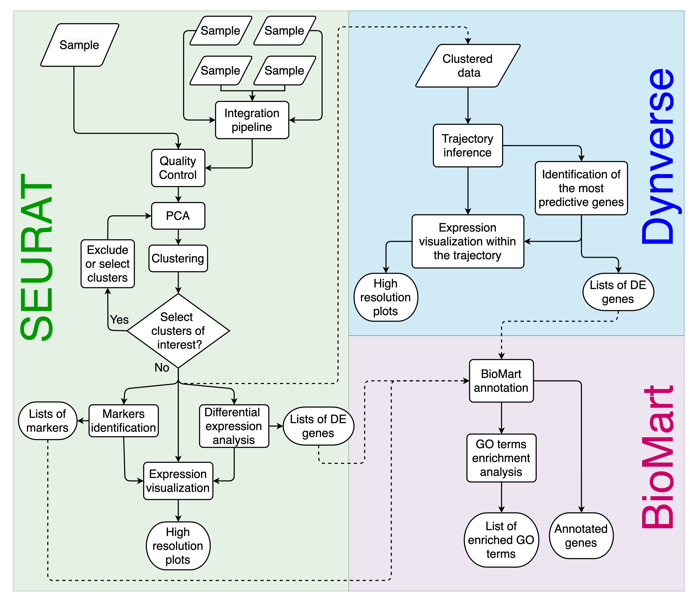

.. Asc-Seurat documentation_

Asc-Seurat documentation
========================

Asc-Seurat (Analytical single-cell Seurat-based web application) is a web application based on Shiny [1]_. Pronounced as “ask Seurat”, it provides a click-based, easy-to-install, and easy-to-use interface that allows the execution of all steps necessary for scRNA-seq analysis (See :ref:`Asc-Seurat workflow <fig-workflow>`). It integrates many of the capabilities of the Seurat [2]_ and Dynverse [3]_ and also allows an instantaneous functional annotation of genes of interest using BioMart [4]_.

Asc_seurat relies on multiple R packages. Please, visit the :ref:`references <references>` and check the complete list of packages and their references.

.. _fig-workflow:

   **Asc-Seurat workflow overview.** Asc-Seurat is built on three analytical cores. Using Seurat, it is possible to explore scRNA-seq data of a population of cells to identify patterns that reflect the cell types of a sample(s) and identify markers and DEGs for each cell type/cluster. By incorporating Dynverse, Asc-Seurat allows the utilization of dozens of models to infer and visualize developmental trajectories (V and VI) and to identify genes differentially expressed on those trajectories (VII). Finally, using BioMart, Asc-Seurat allows immediate functional annotation and GO terms enrichment analysis for many species.

.. toctree::
   :hidden:
   :caption: General information
   :maxdepth: 2

   installation
   references
   packages_version
   license

.. toctree::
   :hidden:
   :caption: Analysis of individual sample
   :maxdepth: 4

   loading_data
   quality_control
   clustering
   differential_expression
   expression_visualization

.. toctree::
   :hidden:
   :caption: Analysis of multiple samples
   :maxdepth: 4

   loading_data_int
   quality_control_int
   clustering_int
   differential_expression_int
   expression_visualization_int

.. toctree::
   :hidden:
   :caption: Trajectory inference
   :maxdepth: 4

   trajectory_inference

.. toctree::
   :hidden:
   :caption: Functional annotation
   :maxdepth: 4

   biomart

.. toctree::
   :hidden:
   :caption: Advanced plots
   :maxdepth: 4

   Advanced_plots

.. warning::

    **Please be aware that Asc-Seurat uses multiple R packages and that many of those are in continuous development**. While the docker version of Asc-Seurat is stable, it may become outdated as the packages on wich it relies on are updated. :ref:`Here <packages_version>` you can find a list of the packages used by Asc-Seurat and their versions.

Release notes
=============

.. tip::

    **To use an old version of Asc-Seurat, check** :ref:`here <test_tip_as_target>`.

v2.2 - **Release on February 8th, 2022**
========================================

 - Add the capacity to load a clustered dataset in the tab for the individual sample analysis.
 - Add the capacity to load a clustered dataset in the tab for the integrated sample analysis.
 - Genes identified as mitochondrial genes via the regex expression are now shown to the users.
 - Changes the color scheme of the dynverse's plots to match the color scheme used by Seurat's plots.
 - Small changes in the interface to improve usability.

 - Fix a bug in the download of markers identified for multiple clusters in the integrated dataset. If a gene was identified as a marker in multiple clusters, a number was appended in the gene's name.
 - Fix a bug that caused the app to crash when searching for conserved markers in an integrated dataset, and the gene was not expressed in one or more of the samples.
 - Fix a bug where plots were exported with a dark background.
 - Fix a bug in the advanced plots that caused expressed genes not to be identified. When using integrated datasets, the function now looks for the RNA assay instead of the integrated assay.
 - Fix a bug where the app would crash when downloading the plots generated in the trajectory inference tab.

v2.1 - **Released on May 26th, 2021**.
======================================

 - Changes the assay used for differential expression analysis and visualization to "RNA" when using SCTransform normalization. Therefore, "SCT" assay is used for the steps until clustering the data.
 - Changes the output of the differential expression analysis to the format required for the visualization tools.

v2.0 - **Released on May 19th, 2021**.
======================================

 - Inclusion of SCTransform normalization
 - Addition of stacked violin plots
 - Addition of multiple-genes dot plot
 - Improvements on the user interface
 - Improvements in the app stability
 - Fix of minor bugs.

v1.0 - **Released on March 19th, 2021**.
========================================

 - Release of Asc-Seurat.

Reference
=========

[1] Pereira WJ, Almeida FM, Balmant KM, Rodriguez DC, Triozzi PM, Schmidt HW, Dervinis C, Pappas Jr. GJ, Kirst M. `Asc-Seurat: analytical single-cell Seurat-based web application <https://doi.org/10.1186/s12859-021-04472-2>`_. BMC Bioinformatics 22, 556 (2021).

Pereira WJ, Almeida FM, Balmant KM, Rodriguez DC, Triozzi PM, Schmidt HW, Dervinis C, Pappas Jr. GJ, Kirst M. `Asc-Seurat – Analytical single-cell Seurat-based web application <https://www.biorxiv.org/content/10.1101/2021.03.19.436196v1>`_. BioRxiv, 2021.

------------

Support Contact
===============

Have any questions or suggestions? Please contact us at `GitHub <https://github.com/KirstLab/asc_seurat/>`_.

------------

Footnotes:

.. [1] `shiny.rstudio.com/ <https://shiny.rstudio.com/>`_
.. [2] `satijalab.org/seurat/ <https://satijalab.org/seurat/>`_
.. [3] `dynverse.org <https://dynverse.org/>`_
.. [4] `www.biomart.org <http://www.biomart.org/>`_
