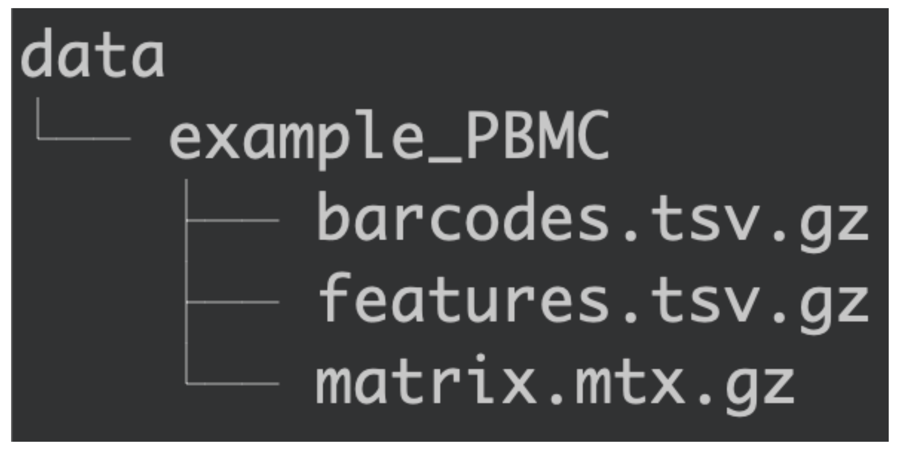
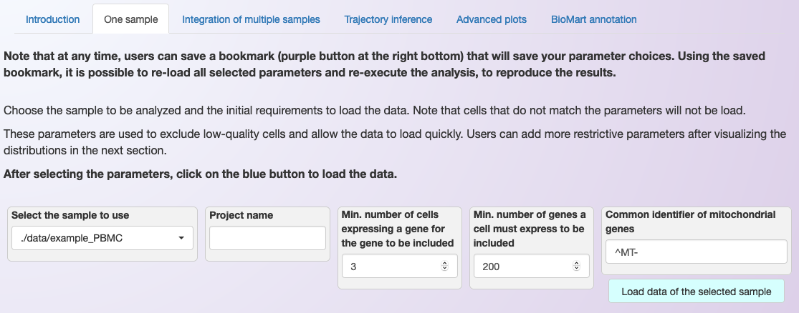

.. _loading_data:

****************************************
Loading the data of an individual sample
****************************************

Location of the dataset
========================

For Asc-Seurat to read the datasets, they need to be located in a subdirectory inside the :code:`data/` directory. The :code:`data/` directory will be created during the installation and contains a subdirectory with an example dataset called :code:`example_PBMC/`. This dataset is from the publicly available `10×'s Peripheral Blood Mononuclear Cells (PBMC) <https://cf.10xgenomics.com/samples/cell/pbmc3k/pbmc3k_filtered_gene_bc_matrices.tar.gz>`_ and contains 2700 cells.

   Organization of the :code:`data/` directory.

Therefore, to add the dataset, create a subdirectory inside :code:`data/` containing the counts' matrix (*matrix.mtx.gz*), cell barcodes (*barcodes.tsv.gz*), and gene names (*features.tsv.gz*).

Asc-Seurat provides separated environments (tabs) to analyze a single sample and the integrated analysis of multiple samples.

Format of the dataset
=====================

Asc-Seurat can only read the input files in the format generated by `Cell Ranger (10x genomics) <https://support.10xgenomics.com/single-cell-gene-expression/software/pipelines/latest/what-is-cell-ranger>`_. However, it is possible to convert your counts' matrix to the acceptable format. For example, the function `write10xCounts() <https://rdrr.io/github/MarioniLab/DropletUtils/man/write10xCounts.html>`_, from the `DropletUtils <https://bioconductor.org/packages/release/bioc/html/DropletUtils.html>`_ package, is an easy option to make this conversion.

.. tip::

    Using `write10xCounts() <https://rdrr.io/github/MarioniLab/DropletUtils/man/write10xCounts.html>`_, users can provide as output the path to the :code:`data/` directory. In this way, Asc-Seurat can recognize the files automatically.

Loading the data
================

To analyze an individual sample, select the second tab in the web application, named :any:`One sample`. Then, choose the sample to analyze and set the initial criteria to exclude cells that should not be load, as shown below.

 After inserting the datasets in the :code:`data/` directory, the samples will be available to load in Asc-Seurat, as shown below.

   Example of how to load an individual sample for analysis and of the requested initial parameters.

In the first box to the left, it is possible to select the sample to use. However, there are a few parameters that need to provide before loading the data. This step is based on Seurat's functions `CreateSeuratObject <https://www.rdocumentation.org/packages/Seurat/versions/3.1.4/topics/CreateSeuratObject>`_ and `PercentageFeatureSet <https://satijalab.org/seurat/reference/PercentageFeatureSet.html>`_. Between parenthesis, we list the name of the parameter in the CreateSeuratObject function.

Below is a description of these parameters:

 * **Project name**: Sets the name for the project. The name will appear in some of the plots, but it is not required (project).
 * **Min. number of cells expressing a gene**: Include genes only if they are detected in at least this many cells (min.cells).
 * **Min. number of genes a cell must express to be included**: Include cells only if they expressed at least this number of genes (min.features).
 * **Regex to identify mitochondrial genes**: Here, the regular expression (`Regex <https://en.wikipedia.org/wiki/Regular_expression>`_) is a sequence of characters that is used to determine the genes belonging to the mitochondrial genome (pattern). For example, when using the human genome, this sequence should be "^MT-".

After setting the parameters described above, click on the button :guilabel:`Load data of the selected sample` to start the analysis. A violin plot showing the distribution of cells will appear. This plot can then be used to set more restrictive parameters for :ref:`quality control <quality_control>`.
