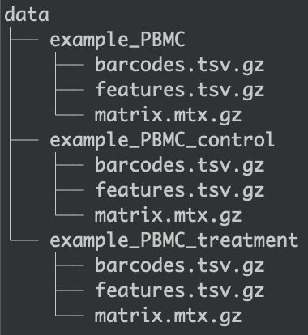
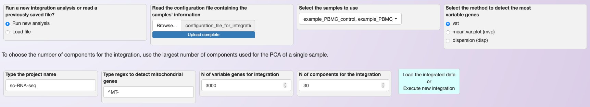
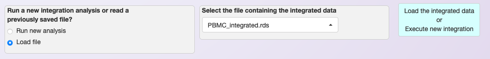

.. _loading_data_int:

****************************************************
Loading the data and integration of multiple samples
****************************************************

To analyze multiple samples, select the third tab in the web application, named :any:`Integration of multiple samples`.

.. note::

    The integration is based on Seurat's functions `FindIntegrationAnchors <https://www.rdocumentation.org/packages/Seurat/versions/4.0.0/topics/FindIntegrationAnchors>`_ and `IntegrateData <https://www.rdocumentation.org/packages/Seurat/versions/4.0.0/topics/IntegrateData>`_. For more information, see `Seurat's integration tutorial <https://satijalab.org/seurat/articles/integration_introduction.html>`_ and `Stuart, T. et al. (2019) <https://www.cell.com/cell/fulltext/S0092-8674(19)30559-8>`_.

Format of the dataset
=====================

Asc-Seurat can only read the input files in the format generated by `Cell Ranger (10x genomics) <https://support.10xgenomics.com/single-cell-gene-expression/software/pipelines/latest/what-is-cell-ranger>`_. However, it is possible to convert your counts' matrix to the acceptable format. For example, the function `write10xCounts() <https://rdrr.io/github/MarioniLab/DropletUtils/man/write10xCounts.html>`_, from the `DropletUtils <https://bioconductor.org/packages/release/bioc/html/DropletUtils.html>`_ package, is an easy option to make this conversion.

.. tip::

    Using `write10xCounts() <https://rdrr.io/github/MarioniLab/DropletUtils/man/write10xCounts.html>`_, users can provide as output the path to the :code:`data/` directory. In this way, Asc-Seurat can recognize the files automatically.

Location of the dataset
========================

For the integration of multiple samples, the process is a little different. Users still need to add their datasets in the :code:`data/` directory, creating a subdirectory for each sample. However, users also need to provide a configuration file containing the parameter values for each sample. During the installation, an example file named *configuration_file_for_integration_analysis.csv* will be created in the directory and can be used as a model.

.. note::

	The integration of samples can be biased if the parameters are not chosen appropriately. Therefore, it is recommended to explore each sample separately in the tab :guilabel:`One sample`, defining adequate parameters to remove deficient quality cells before the integration.

The user's configuration file must have six columns and a header (the column names are not restricted). They specify what cells should be kept for each sample while loading the data before the integration.

Also, the columns need to be in a specific order, as listed below.

 #. **Subdirectory name**: The name of the subdirectories containing the datasets. Each sample must have a unique name for its subdirectory, even if they are replicates.
 #. **Sample name (any name you prefer)**: Your choice of name for each sample. If you have replicates and want them to be considered as one in the plots and analysis, use the same name for all replicates.
 #. **Min. number of cells expressing a gene**: Include genes only if they are detected in at least this many cells.
 #. **Min. number of genes a cell must express to be included**: Include cells only if they expressed at least this number of genes.
 #. **Maximum number of genes a cell can express and still be included**: Remove cells that express more than this number of genes. Useful to remove cells that are suspected to be doublets.
 #. **Maximum percentage of genes belonging to the mitochondrial genome**: Here, the regular expression (`Regex <https://en.wikipedia.org/wiki/Regular_expression>`_) is a sequence of characters that is used to identify the genes belonging to the mitochondrial genome. For example, when using the human genome, this sequence should be "^MT-".

Loading the data and performing integration
===========================================

To demonstrate the necessary steps to load and integrate multiple datasets using Asc-Seurat, we used two groups of cells from `Kang et al., 2017 <https://www.nature.com/articles/nbt.4042>`_, that are also used in `Seurat's tutorial <https://satijalab.org/seurat/archive/v3.1/immune_alignment.html>`_ demonstrating the comparison of multiple samples. Two datasets are used, both containing peripheral blood mononuclear cells (PBMCs). However, the first dataset contains the cells of the control group (Control), while the second dataset contains cells treated with interferon-beta (Treatment).

The first step is two create two folders inside the :code:`data/` folder. The folders were named :code:`example_PBMC_control` and :code:`example_PBMC_treatment`, each containing the three necessary input files (shown in the image below).

   Organization of the :code:`data/` folder the different datasets.

After that, it is necessary to create a configuration file in the csv format. During the installation, an example file named *configuration_file_for_integration_analysis.csv* is created in the directory. It can then be used as a model. For this example, the configuration file contains the information shown below.

.. table:: Example of a configuration file for the integration of multiple samples.
   :widths: 16 16 16 16 16 16

   +------------------------------------------+-----------------------------------+----------------------------------------+---------------------------------------------------------+---------------------------------------------------------------+------------------------------------------------------------------+
   | Subdirectory name (must be inside data/) | Sample name (any name you prefer) | Min. number of cells expressing a gene | Min. number of genes a cell must express to be included | Max. number of genes a cell can express and still be included | Max. percentage of transcripts belonging to mitochondrial genome |
   +==========================================+===================================+========================================+=========================================================+===============================================================+==================================================================+
   | example_PBMC_control                     | Control                           |                    3                   |                           250                           |                              2500                             |                                 5                                |
   +------------------------------------------+-----------------------------------+----------------------------------------+---------------------------------------------------------+---------------------------------------------------------------+------------------------------------------------------------------+
   | example_PBMC_treatment                   | Treatment                         |                    3                   |                           250                           |                              2500                             |                                 5                                |
   +------------------------------------------+-----------------------------------+----------------------------------------+---------------------------------------------------------+---------------------------------------------------------------+------------------------------------------------------------------+

Once the configuration file is ready, users only need to load it in the app and select the samples they want to integrate (see image below). Also, it is necessary to choose the normalization method, the regex string to detect mitochondrial transcripts, the number of Principal Components to be used during the integration (see below). Note that while default values are provided, users need to set these parameters based on their evaluation of the individual samples that are being integrated.

   Loading configuration file and defining parameters for the integration of multiple samples using LogNormalization.

Saving integrated data for reanalysis
=====================================

The integration of multiple samples is a timing-consuming step of the analysis. The amount of time necessary to execute this step depends on the number of datasets and the number of cells in each dataset, and it can take several minutes to be concluded.

Therefore, Asc-Seurat allows users to save the integrated data and skip the integration step the next time users need to use the same dataset. To save the data, users can click on the button :any:`Download RDS object containing the integrated data.` and save the rds file inside the :code:`RDS_files/` folder.

Next time this data is necessary, users can select the option "Load file" and skip the integration step, as shown below.

