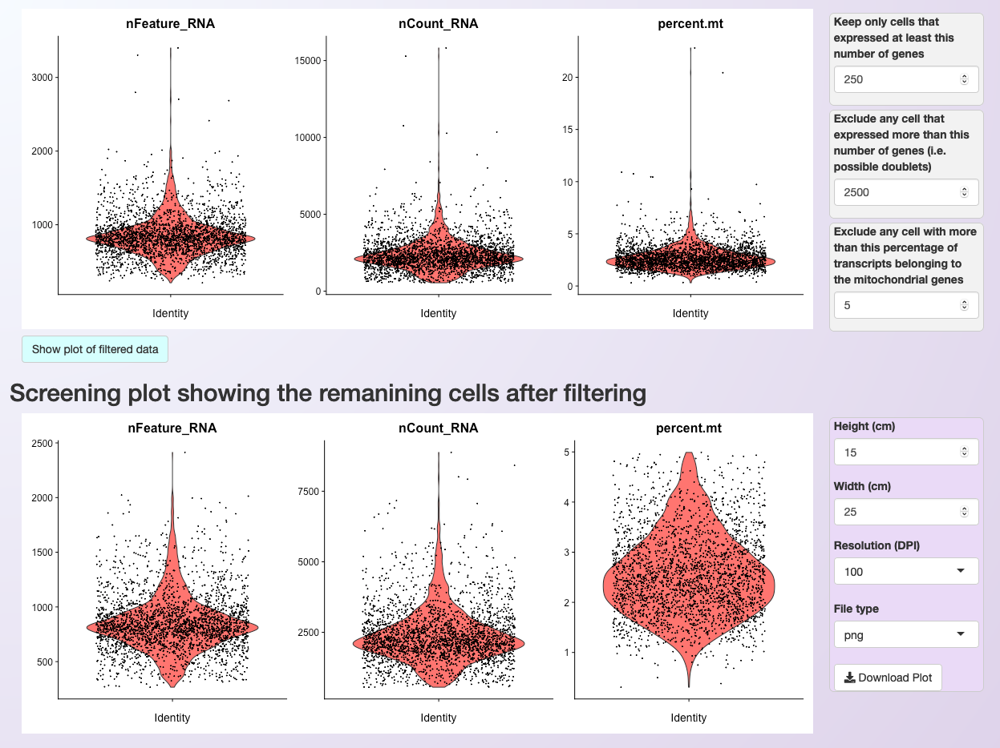

.. _quality_control:

***************
Quality control
***************

After loading the data, a `violin plot <https://satijalab.org/seurat/reference/vlnplot>`_ will be generated showing the distribution of cells according to three parameters:

 * nFeature_RNA: the number of genes detected in each cell
 * nCount_RNA: the number of molecules detected per cell
 * percent.mt: the percentage of transcripts that map to mitochondrial genes

After visualizing the distribution of cells, it is possible to set more restrictive parameters (on the right side of the plot) and filter cells based on the number of expressed genes per cell and the percentage of transcripts from mitochondrial genes. By clicking on :guilabel:`Show plot of filtered data`, users can see the distribution of cells after filtering and then readjust the parameters. The figure below shows the distribution of cells of the PBMC dataset before and after filtering.

Asc-Seurat allows users to download each of the plots with high-resolution by clicking on the :any:`Download plot` button.
