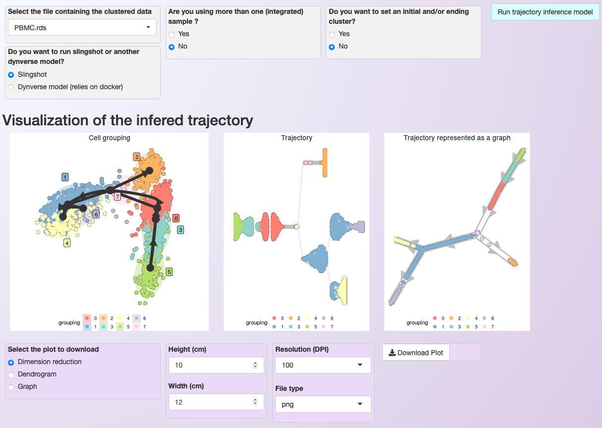

.. _trajectory_inference:

********************
Trajectory inference (ongoing)
********************

For trajectory inference analysis, users can either execute it through capabilities of the embedded `slingshot <https://bioconductor.org/packages/release/bioc/html/slingshot.html>`_ Bioconductor package or select another model contained in `dynverse <https://dynverse.org/>`_, executed using a docker image provided by the later. In both options, users only need to select the model and initial parameters (see below). However, the direct execution of slingshot is faster than the execution of models via dynverse’s docker image.

.. warning::

	Some of the models included in dynverse are computationally intensive. It is strongly recommended to check the requirements for a model before executing it on Asc-Seurat. You can use `dynguidelines web application <https://zouter.shinyapps.io/server/>`_ to investigate the necessary resources to analyze your dataset. Also, see the warning on the section :ref:`installation` explaining how to adjust the amount of resources available to Docker in your machine.

Trajectory inference and visualization
======================================

To start the trajectory inference analysis, users need to save the clustered data in a specific folder automatically created during the installation (:code:`RDS_files/`). Asc-Seurat recognizes the data automatically and users can select the sample to be used. Next, users need to select the model to be used, inform if the data is composed by one or multiple integrated samples and, optionally, inform the cluster(s) expected to be at the beginning and/or end of the inferred trajectory. After executing the analysis, three plots showing `different inferred trajectory representations <https://dynverse.org/users/3-user-guide/4-visualisation/>`_ are generated. Moreover, when using an integrated dataset, users can also color the cells according with the sample of origin. To demonstrate this capabilities, we used the PBMC integrated dataset (containing two samples, Control and Treatment).

   Asc-Seurat provides multiple models for trajectory inference analysis and three options for trajectory visualization.

.. figure:: images/trajectory_inference_colored_by_sample.png
  :width: 100%
  :align: center

  When using an integrated dataset, it is also possible to color the cells according with the sample that originated them.

Expression visualization within the trajectory and identification of DEGs in the trajectory
==========================================================================================

After inferring the developmental trajectory, it is possible to visualize the expression of genes of interest in the cells within the trajectory. Asc-Seurat provides two options for this visualization, 1) a heatmap displaying the expression of genes in each cell, ordered by the cell position within the trajectory, and 2) the visualization of the same three trajectory’s representation shown above but colored by the gene expression.

Users can either load their list of genes of interest or `identify DEGs within the trajectory <https://dynverse.org/users/3-user-guide/6-tde/>`_ for the visualization.

For the PBMC dataset, we opted to show the 50 most significant DEGs within the trajectory, as ranked by their “importance” value on explaining the inferred trajectory (Figure S12).
