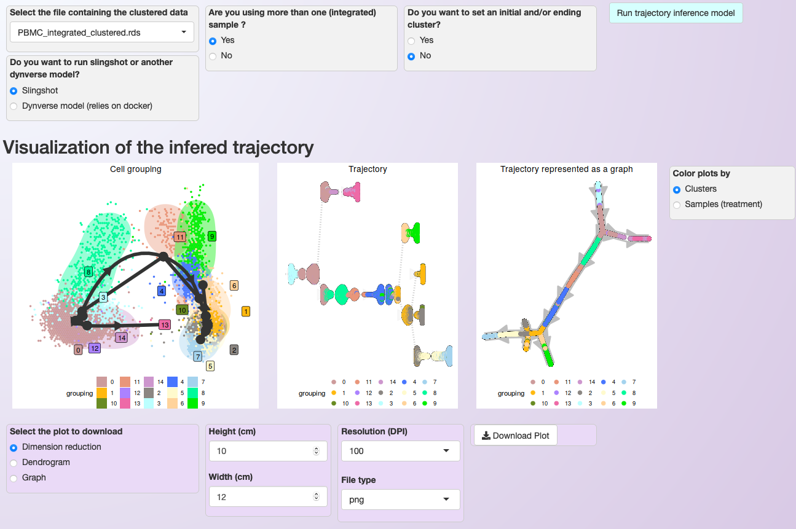
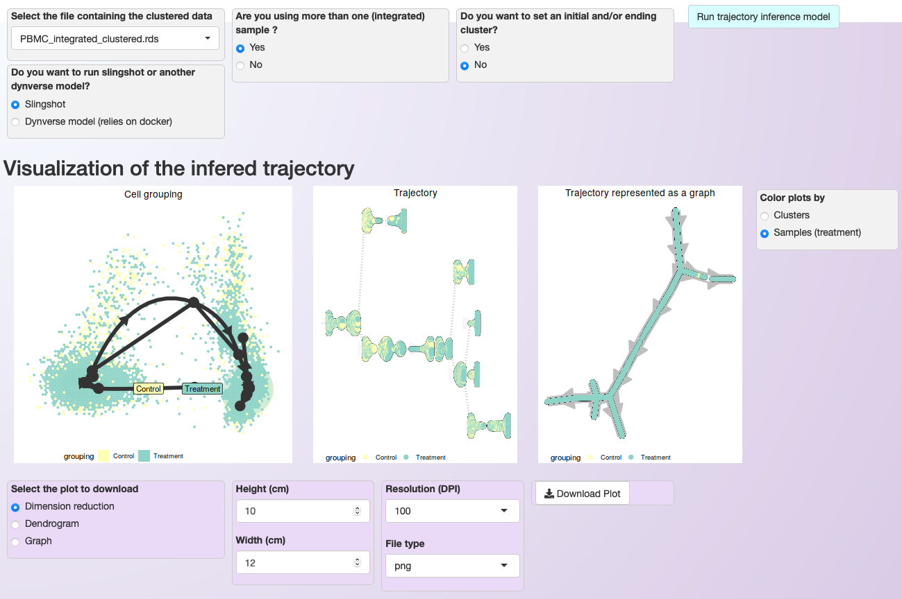
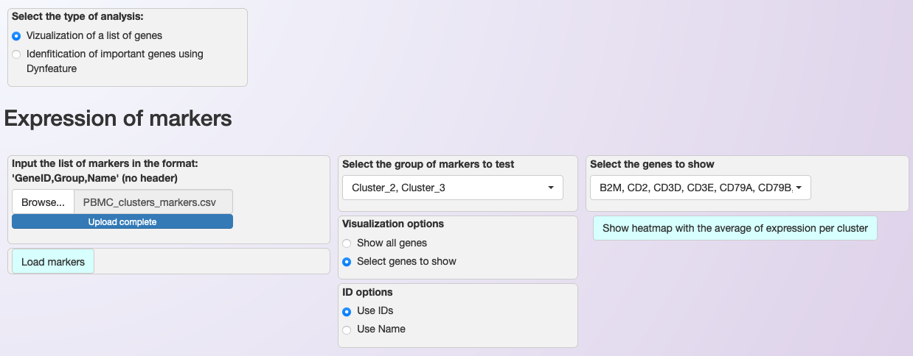
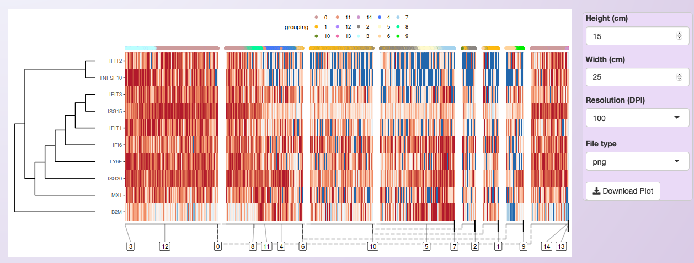
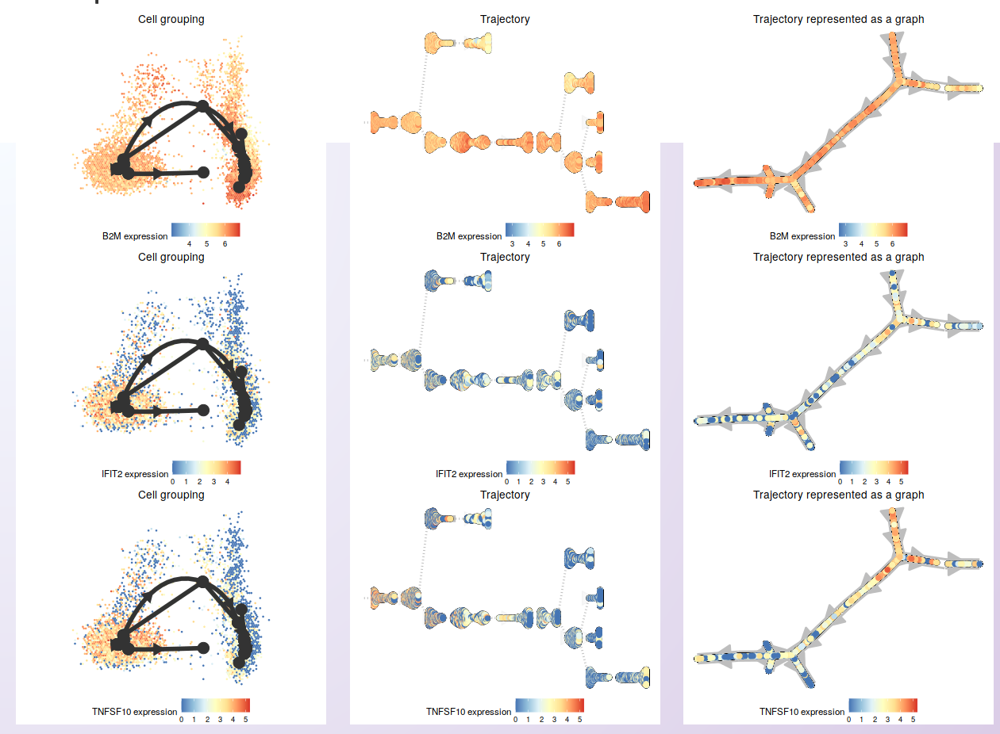
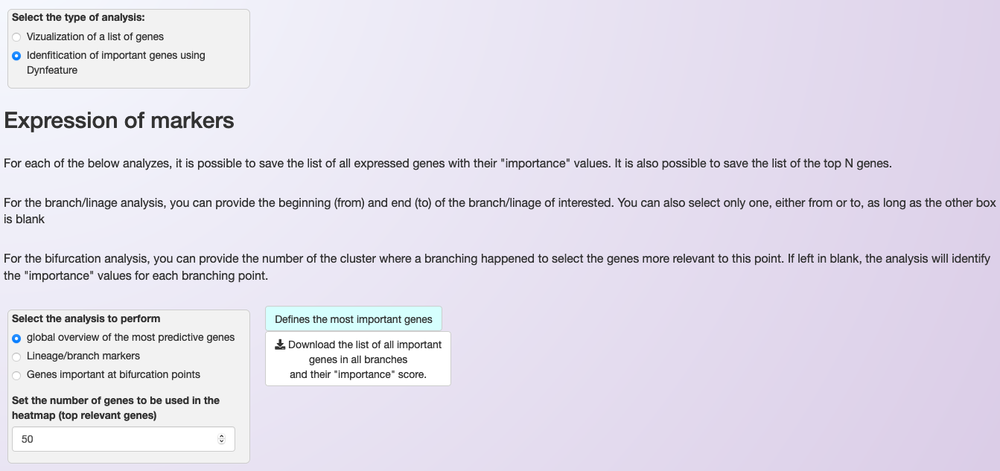
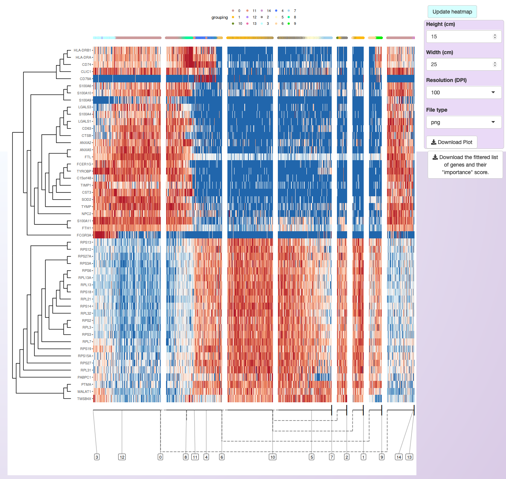
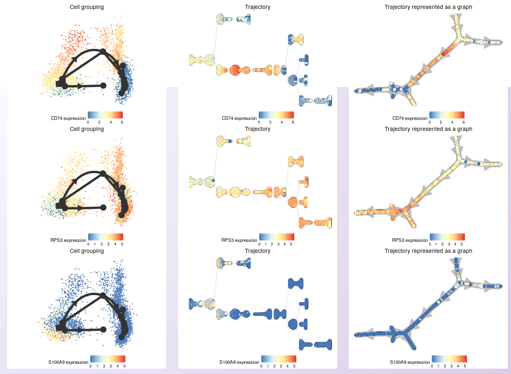

.. _trajectory_inference:

********************
Trajectory inference
********************

For the trajectory inference analysis, users can either execute it through capabilities of the embedded `slingshot <https://bioconductor.org/packages/release/bioc/html/slingshot.html>`_ (Bioconductor) package or select another model contained in `dynverse <https://dynverse.org/>`_, executed using a docker image provided by dynverse. In both options, users only need to choose the model and initial parameters (see below). However, the direct execution of slingshot is faster than executing models via dynverse’s docker image.

To inform the model's choice, it is recommended the reading of `Saelens et al., 2019 <https://www.nature.com/articles/s41587-019-0071-9>`_ paper, that benchmarked a diversity of models. Different models will perform better or worst depending on the topology of the developmental trajectory of the dataset (that is unknown a priory). Therefore, users need to consider what topology they may expect for their dataset. For example, slingshot performs well for bifurcated, multifurcated, or "tree" like topologies, but not for cyclic or more complex disconnected trajectories.

.. warning::

	Some of the models included in dynverse are computationally intensive. It is strongly recommended to check the requirements for a model before executing it on Asc-Seurat. You can use `dynguidelines web application <https://zouter.shinyapps.io/server/>`_ to investigate the necessary resources to analyze your dataset. The amount of resources also depends on the number of cells and the complexity of the dataset.

Executing the trajectory inference and trajectories visualization
=================================================================

To start the trajectory inference analysis, users need to save the clustered data in a specific folder automatically created during the installation (:code:`RDS_files/`). Asc-Seurat recognizes the data automatically, and users can select the sample to be used. Next, users need to select the model to be used, inform if the data is composed of one or multiple integrated samples, and, optionally, inform the cluster(s) expected to be at the beginning and/or end of the inferred trajectory. After executing the analysis, three plots showing `different inferred trajectory representations <https://dynverse.org/users/3-user-guide/4-visualisation/>`_ are generated. Moreover, when using an integrated dataset, users can also color the cells according to the sample of origin. To demonstrate these capabilities, we used the PBMC integrated dataset (containing two samples: Control and Treatment).

.. note::

	The time to execute the trajectory varies from minutes to hours, depending on the complexity of the dataset and the chosen model. Visit `dynguidelines web application <https://zouter.shinyapps.io/server/>`_ for an estimative.

For the PBMC integrated dataset, slingshot was used to infer the developmental trajectory. Note that no cluster was select as the start or end of the trajectory, so slingshot makes this decision. If you know what cluster (or cell type) is expected at the beginning or end of the trajectory, providing this information will allow a better interpretation of the generated trajectory.

When users inform that multiple samples are used, Asc-Seurat offers coloring the cells by cluster identify or by samples. Both options are demonstrated below for the PBMC integrated dataset.

   **Asc-Seurat provides multiple models for trajectory inference analysis and three options for trajectory visualization**. In this case, cells are colored by clusters.

   **Asc-Seurat provides multiple models for trajectory inference analysis and three options for trajectory visualization**. In this case, cells are colored by sample.

.. tip::

	Suppose you are interested in studying the developmental trajectory of a subgroup of clusters only. In that case, it is better to exclude the other clusters than to try to infer the trajectory using the whole dataset. The model will execute quicker and provide a better resolution of the trajectory since the complexity of the dataset is reduced. Asc-Seurat allows the exclusion of clusters from your dataset, see :ref:`target_to_ref_excluding_clusters_one` (one sample) or :ref:`target_to_ref_excluding_clusters_int` (integrated dataset).

Expression visualization within the trajectory and identification of DEGs in the trajectory
===========================================================================================

After inferring the developmental trajectory, it is possible to visualize the expression of genes of interest in the cells within the trajectory. Asc-Seurat provides two options for this visualization, 1) a heatmap displaying the expression of genes in each cell, ordered by the cell position within the trajectory, and 2) the visualization of the same three trajectory’s representation shown above but colored by the gene expression.

Users can either load their list of genes of interest or `identify DEGs within the trajectory <https://dynverse.org/users/3-user-guide/6-tde/>`_ for the visualization.

Visualizing the expression of a list of selected genes
------------------------------------------------------

To visualize the expression of specific genes, the process is similar to the described on :ref:`expression_visualization`. Asc-Seurat expects as input a csv (comma-separated value) file containing at least two columns. The first column must contain the gene ID as present in your dataset, and the second column is a grouping variable. An optional third column can contain the common names of each gene. Any additional column will be ignored. **No header is allowed for this file**.

After loading the input file, users can then select what group(s) of genes to explore, as well as select specific genes from each group. Moreover, if a third column is provided in the input file, users can use the common name of the genes instead of the gene IDs to select the genes to be shown.

After choosing the genes, a heatmap showing the expression in the cells sorted by their position in the inferred trajectory is shown. Then, users can select genes for individual visualization.

As an example, it is shown the expression of the same ten DEGs identified for cluster 4 in the comparison of Control and Treatment for the PBMC integrated dataset (see :ref:`differental_expression_int`).

Next, three of those genes were selected to show the expression on the cells in the inferred trajectory.

Identification of DEGs in the trajectory
----------------------------------------

To identify differentially expressed genes, Asc-Seurat deploys the `dynfeature <https://github.com/dynverse/dynfeature>`_, part of dynverse's collection of packages. Here we provide a short introduction to these methods. Please, visit dynverse's `Trajectory differentially expression page <https://dynverse.org/users/3-user-guide/6-tde/>`_ for a demonstration of each method.

Asc-Seurat allows the search for DEGs within the whole trajectory, in a branch of the trajectory between two clusters or in a branching point. Each of these methods will rank all genes of the dataset. Therefore, users need to select the number of genes (ranked by the most important genes) to visualize in the heatmap. Also, users can download the list of all genes and their "importance values".

As an example, for the PBMC integrated dataset, we opted to show the 50 most significant DEGs within the trajectory, as ranked by their “importance” value on explaining the inferred trajectory.

From those, a few genes were selected for expression visualization on the trajectory.

